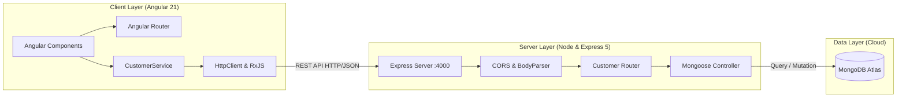

<div align="center">

# ⚡ *CUSTOMER APP — Full-Stack MEAN Management Platform*

**A high-performance, full-stack customer relationship management web application built on the MEAN Stack.**

<br/>

[](#)
[](#)

<br/>

<!-- Tech Stack Badges Matrix -->
[](#)
[](#)
[](#)
[](#)

[](#)
[](#)
[](#)
[](#)
[](#)

</div>

---

## 🎯 Overview

**Customer App** is an end-to-end full-stack CRUD application engineered using modern web development standards. It features a reactive, component-driven frontend powered by **Angular 21** and a robust RESTful backend built on **Express 5** and **MongoDB Atlas**.

---

## ✨ Key Features

<table>
  <tr>
    <td width="50%">
      <h3>👥 Customer Directory</h3>
      <p>Clean, paginated-ready responsive data view displaying all active customer records with real-time state synchronization.</p>
    </td>
    <td width="50%">
      <h3>➕ Customer Onboarding</h3>
      <p>Reactive form with client-side & server-side validation for quick registration (name, email, phone number).</p>
    </td>
  </tr>
  <tr>
    <td width="50%">
      <h3>🔍 Deep Profile Insights</h3>
      <p>Dedicated customer details view with complete metadata, contact history, and record creation timestamps.</p>
    </td>
    <td width="50%">
      <h3>✏️ Dynamic Updates & Deletion</h3>
      <p>One-click inline updates and instant deletion with automated UI refresh via RxJS Observables.</p>
    </td>
  </tr>
</table>

---

## 🏗️ System Architecture



---

## 🗂️ Project Structure

```text
Customer-app/
├── 📂 back-end/
│   ├── 📂 models/
│   │   └── 📄 customer.js          # Mongoose Schema & Data Model
│   ├── 📂 routes/
│   │   └── 📄 customer.js          # REST Controller & API Endpoints
│   ├── 📄 app.js                   # Server bootstrap & DB connection
│   ├── 📄 package.json             # Express, Mongoose & CORS dependencies
│   └── 📄 package-lock.json
│
├── 📂 front-end/
│   ├── 📂 src/
│   │   ├── 📂 app/
│   │   │   ├── 📂 components/
│   │   │   │   ├── 📂 customer-list/     # Table & directory view
│   │   │   │   ├── 📂 customer-create/   # Form to add new customer
│   │   │   │   ├── 📂 customer-edit/     # Record modification form
│   │   │   │   └── 📂 customer-details/  # Single profile overview
│   │   │   ├── 📂 models/
│   │   │   │   └── 📄 customer.module.ts # TypeScript interfaces
│   │   │   ├── 📂 services/
│   │   │   │   └── 📄 customer.ts        # HTTP API Service
│   │   │   ├── 📄 app.routes.ts          # Angular SPA route registry
│   │   │   ├── 📄 app.ts / app.html      # Root shell component
│   │   │   └── 📄 app.config.ts          # Angular application config
│   │   ├── 📄 index.html
│   │   ├── 📄 main.ts
│   │   └── 📄 styles.css
│   ├── 📄 angular.json             # Angular workspace configuration
│   └── 📄 package.json             # Angular 21, Material & Bootstrap
└── 📄 README.md
```

---

## 📡 REST API Reference

Base Endpoint: `http://localhost:4000/api/customers`

| Method | Endpoint | Description | Payload |
|:---:|:---|:---|:---|
|  | `/api/customers` | Retrieve list of all customers | _None_ |
|  | `/api/customers/:id` | Retrieve customer by ID | _None_ |
|  | `/api/customers` | Register a new customer | `{ "name": "string", "email": "string", "phone": "string" }` |
|  | `/api/customers/:id` | Update existing customer data | `{ "name": "string", "email": "string", "phone": "string" }` |
|  | `/api/customers/:id` | Remove customer record | _None_ |

---

## 🚀 Quick Start Guide

### 1. Prerequisites
- **Node.js**: v18.x or higher
- **npm**: v9.x or higher

---

### 2. Backend Installation & Launch

```bash
# Navigate to back-end
cd back-end

# Install dependencies
npm install

# Start Express server with auto-reload
npm run dev
```

> 🟢 **Backend running at:** `http://localhost:4000`

---

### 3. Frontend Installation & Launch

```bash
# Open a new terminal and navigate to front-end
cd front-end

# Install dependencies
npm install

# Start Angular development server
npm start
```

> 🌐 **Frontend application ready at:** `http://localhost:4200`

---

## 🛠️ Tech Stack & Dependencies

<div align="center">

| Layer | Technologies & Libraries |
|:---|:---|
| **Frontend** | Angular 21, TypeScript 5.9, Angular Material, Bootstrap 5.3, RxJS, Zone.js |
| **Backend** | Node.js, Express.js 5, CORS, Nodemon |
| **Database** | MongoDB Atlas, Mongoose ODM 9.9 |
| **Tooling** | Angular CLI 21, Prettier, Vitest |

</div>

---

<div align="center">

Made with ❤️ using the **MEAN Stack**

</div>
